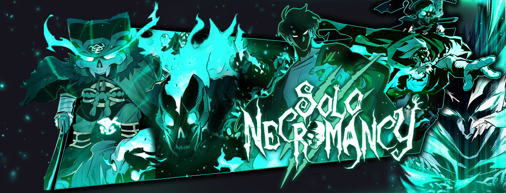


 <!-- 
 enius-swordman.jpg
 returner.avif
 Eleceed-1.webp
 banner4.jpg
 -->

# Webtoons Site

A personal project built to share my passion for webtoons while improving my programming skills.  
The site offers an interactive tier list, with fun mini-games for fans to enjoy and freely indulge their passion.

---

## 🌟 Features

**Main Page**
- Interactive **tier list** with custom categories (Excellents, Très Bons, Bons, etc.)
- Webtoon search functionality
- Contact form to reach the creator

**Games Page**
- **Memory Game** with multiple difficulty levels and a global leaderboard
- **Guess the Webtoon** : identify the correct webtoon from an image, with multiple categories

*More features coming soon...*

---

## 🛠️ Technologies Used

- **Frontend :** HTML, CSS, JavaScript (no frameworks)
- **Backend / Scripts :** Small portions of Python and PHP
- **Database & Auth :** Firebase
- **Hosting :** GitHub Pages

---

## 👥 Target Audience

Fans of webtoons looking for interactive experiences, games, and community-driven features.

---

## 📈 Project Status

The site is [live](https://guip4pro.github.io/Site-Webtoons) and functional, but new features and improvements are actively being developed.

---

## 👤 Author

- **Name:** Guillaume Marolleau
- **Instagram:** [@g_uillaumy](https://www.instagram.com/g_uillaumy?igsh=OXdjNTd1c3JncXNo) 
You can contact me via the contact form in my site or by opening an [issue](https://github.com/Guip4pro/Site-Webtoons/issues) on this repository.

---

## 📜 Contributing

Currently, no open-source license is applied.
Contributions, issues and feature requests are welcome.

